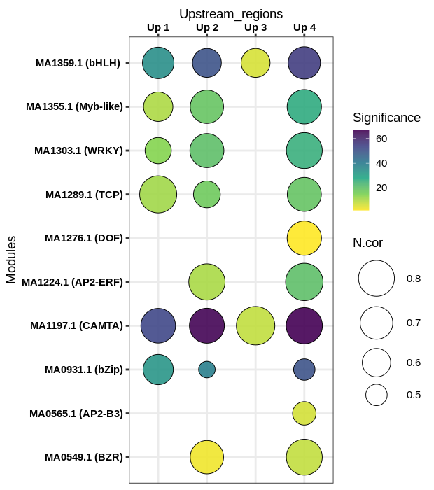

# R_scripts

This repository contains some helpful R scripts and datasets.
Before starting, make sure that you have installed
* R (version >=3.6.1)
* RStudio

# List of scripts

- **Static and intercative bubble plot**: 

This script return a bubble chart where the bubble size corresponds to the normalized correlation (Ncor) and colors refer to the statistical significance.  

Using the Plotly's R graphing library, we can transforme the static chart to intercative one [See example](file:///home/sie/Descargas/PlotlyScatterExample.html). The Plotly.R is free and open source.   

